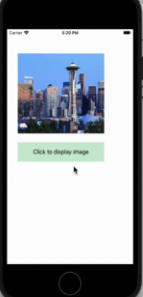
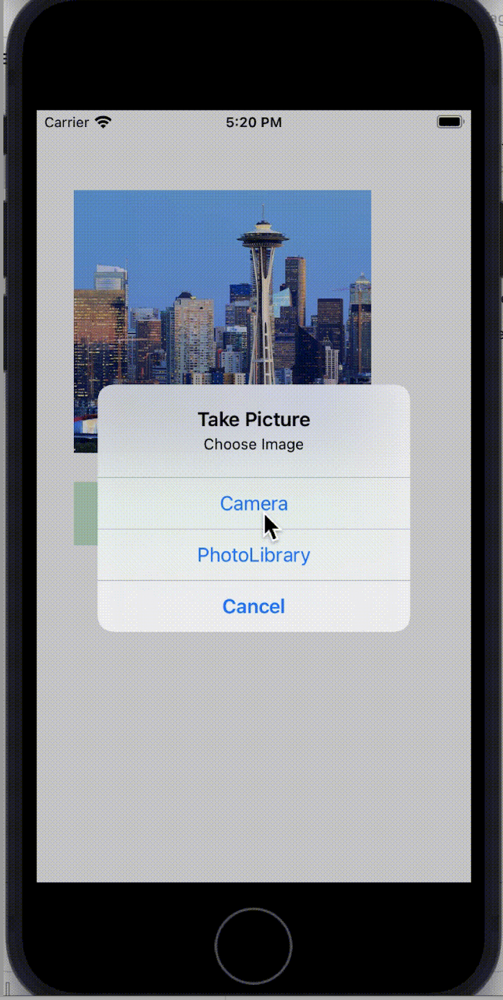

# TakePicture

TakePicture is an IOS app for implementing the usage of camera and photolibrary. Also implemented the localization for translation in local languages.

## Implementation Details

* User can take picture from Camera and display it is UIImageView
* User can select image from photolibrary display in UIImageView
* Implemented localization in local language translation. 

## Localization implementation details

* Created a folder named as "Localizable". Added stringfiles for each language by selecting "TakePicture"->"Info" tab in settings->Localizations-> add the languages.
* Edit each string file for translation of phrases in respectived language
* Create a swift file for storing the translation in variable to be used in code. For example

 ```var strTakePicture=NSLocalizedString("Click to display image", comment: "")``` used this for locallising phrase "Click to display image"

## How to run
 * Clone the repo https://github.com/dj0894/TakePicture.git
 * Open app TakePicture/TakePicture in XCode and run using simulator
 
## Demo


## ScreenShots



    					


		
		
